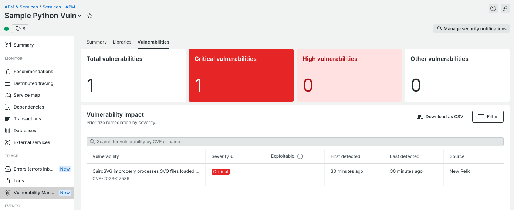

# Sample Python vulnerable application

## run the following commands for local testing

```
export NEW_RELIC_LICENSE_KEY=<NEW_RELIC_LICENSE_KEY>
pip3 install -r requirements.txt
python3 sample-python-vuln.py
```

